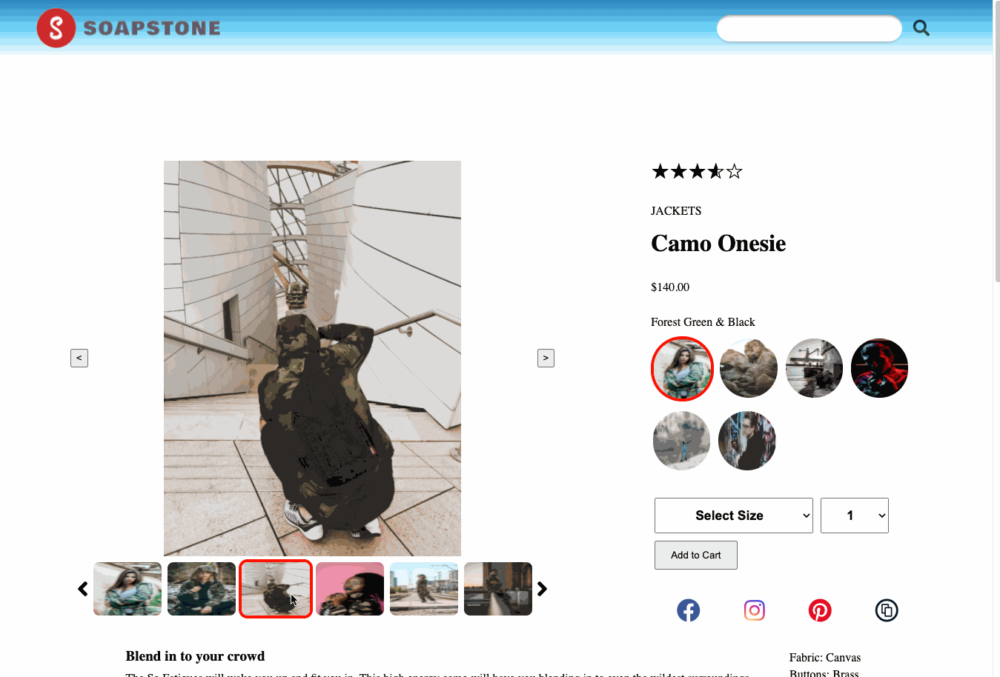
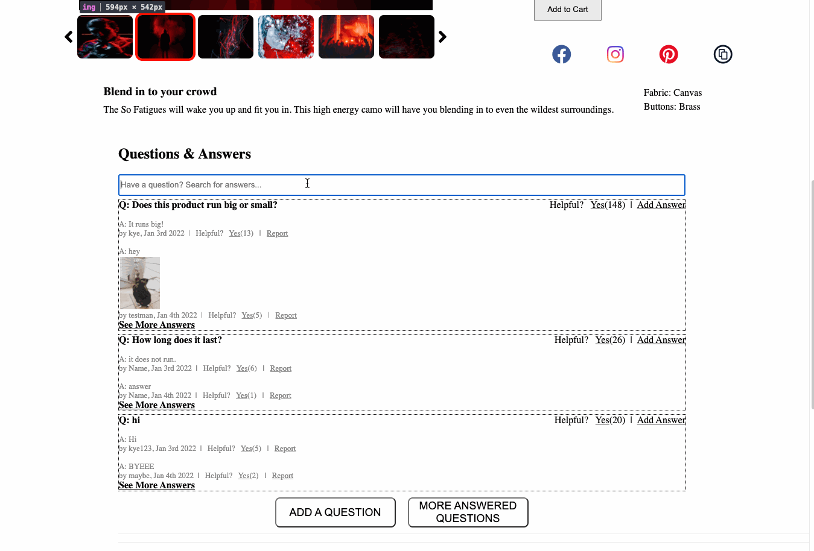
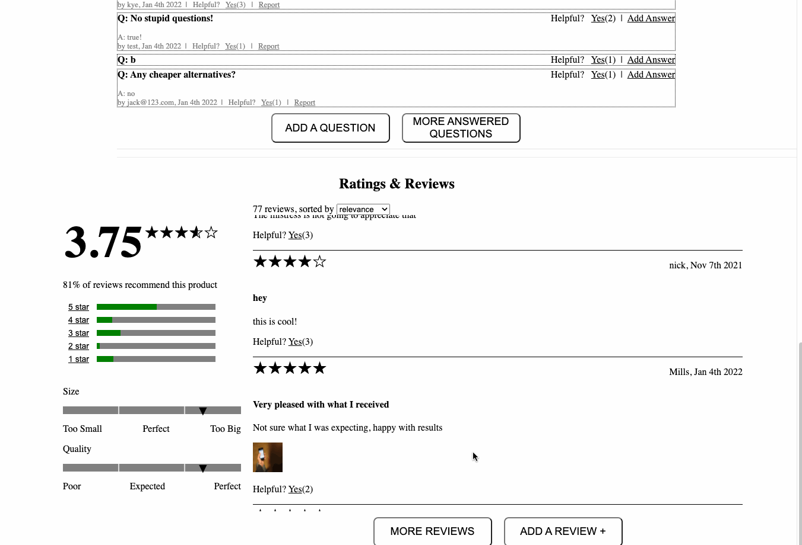
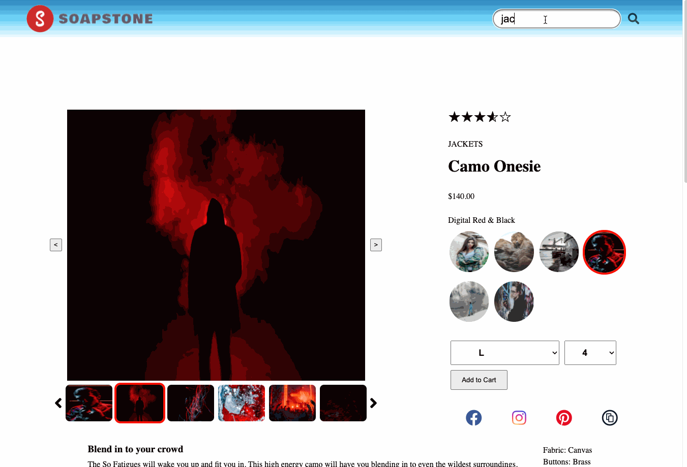

# Project Catwalk - Soapstone Group

## Table of Contents

1. [General Info](#general-info)
2. [Demo](#demo)
3. [Technologies Used](#technologies-used)
4. [Contributors](#contributors)

## General Info

Soapstone Group is a group of like-minded individuals that came together deliver based off of client needs. For this particular product, we are creating a modernized client-facing retail web-portal, called Project Catwalk. This retail portal will provide the following function upon it's initial release and deployment:

**Overview**
* An image gallery
* Information about the current product
* A selector to choose between varying styles
* Add to cart functionality

**Questions and Answers**
* A list of all questions asked by users
* A search functionality to filter by questions
* Ability to ask and answer a question

**Reviews**
* A list of all reviews given by users
* A breakdown of the ratings and the ability to filter reviews
* An additional breakdown of comfort and fit of the product
* Ability to provide a review
## Demo

### Overview

### Questions & Answers

### Ratings & Reviews

### Changing Product with Search Bar

## Technologies Used
Please note that the below are a list of all major dependencies used in the project. There could be various adapters and minor dependencies needed. Please ensure to install the necesary modules with NPM.

* React: Version 15.6.0
* React-DOM: Version 15.6.0
* Moment: Version 2.29.1
* Axios: Version 0.24.0
* Babel: Version 7.16.5
* Webpack: Version 5.65
* Jest: Version 27.4.5
* Enzyme: Version 3.11.0

## Contributors
* [Kevin Sheng](https://github.com/ks10825n)
* [Kye Lindholm](https://github.com/kyelindholm)
* [Leonardo Deutsch](https://github.com/leonardodeutsch)